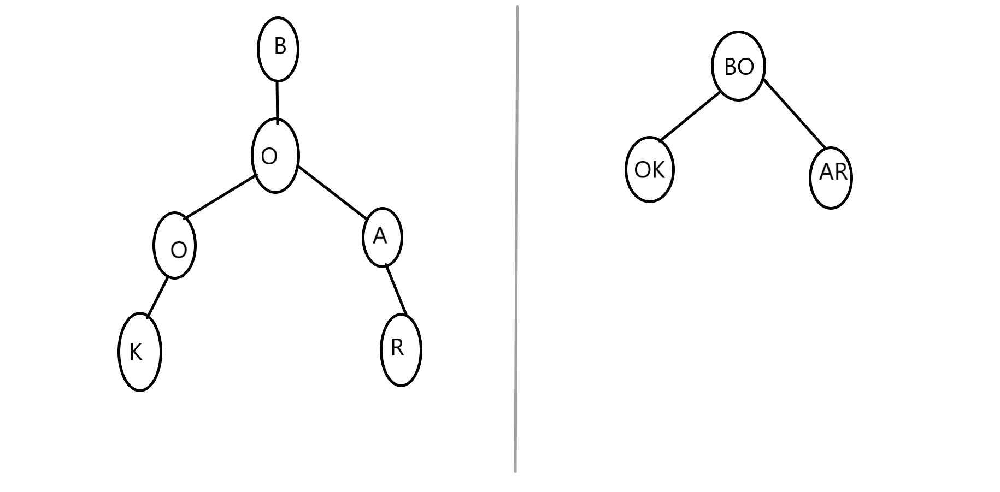

# CompressedTrieJob
## Explanation
- A Compressed Trie, also known as a Radix Tree or Patricia Trie, optimizes the traditional Trie by reducing the number of nodes. Instead of storing each character in separate nodes, it merges nodes that have a single child into a single edge with a string label.
- Reduces Space Complexity
